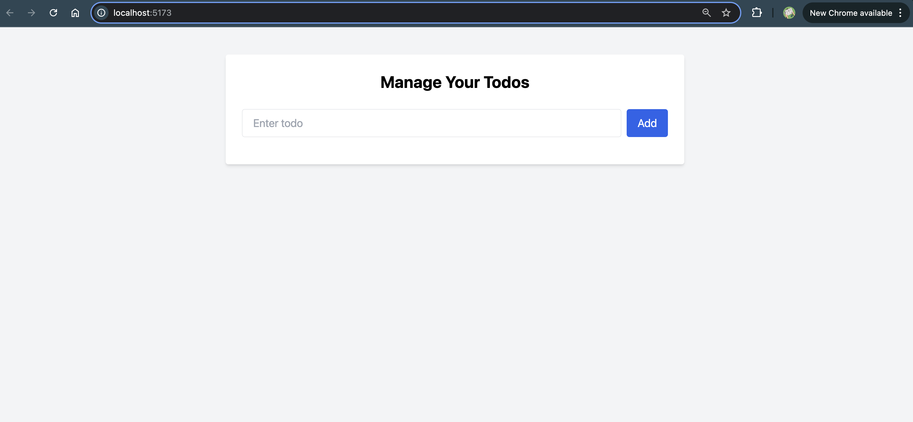

# 📝 React Todo App – Context API + LocalStorage

This is a simple yet powerful Todo App built using **React**, featuring:

- Global state management with **Context API**
- Persistent todos using **LocalStorage**
- Ability to **add**, **edit**, **delete**, and **toggle** todos



---

## 🚀 Features

- Add new todo tasks
- Mark todos as completed
- Edit existing todos
- Delete todos
- Data persists across page reloads via localStorage
- Minimal and clean UI

---

## ⚙️ Technologies Used

- **React**
- **Context API**
- **LocalStorage**
- **Tailwind CSS** (optional/styling)

---

## 🛠️ How to Run the Project

### 1. Clone the Repository

```bash
git clone https://github.com/your-username/your-repo-name.git
cd your-repo-name
```

### 2. Install Dependencies

```bash
npm install
```

### 3. Start the Development Server

```bash
npm run dev
```

---

## 🧠 Learnings

Through this project, I practiced:

- Managing global state with React Context
- Understanding how `useState`, `useEffect`, and localStorage work together
- Structuring components for reusable logic
- Using JavaScript array methods like `map`, `filter`, and spread syntax

---

## 📂 Project Structure

```
├── public/
├── src/
│   ├── components/
│   │   ├── TodoForm.jsx
│   │   └── TodoItem.jsx
│   ├── context/
│   │   └── TodoContext.js
│   ├── screenshot/
│   │   └── screenshot.png
│   ├── App.jsx
│   └── main.jsx
├── tailwind.config.js
├── package.json
└── README.md
```

---

## ✍️ Author

- **Manjinder Singh**

---
